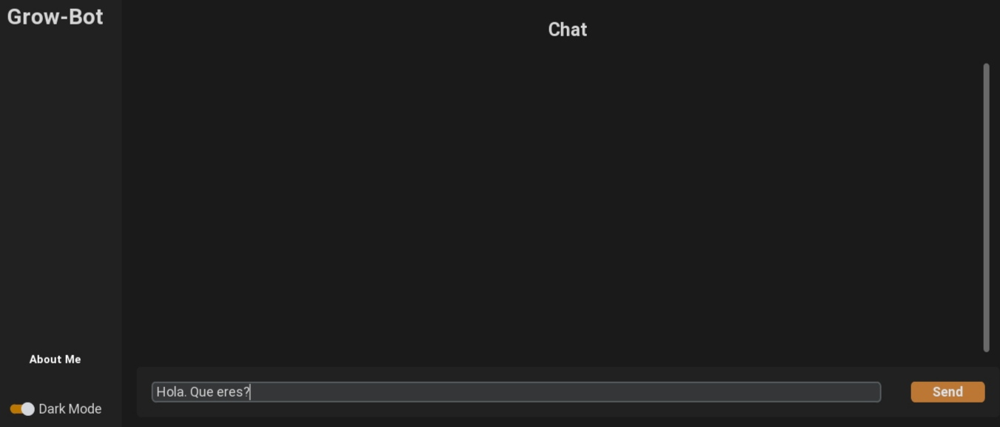

# Grow-Bot
GrowBot, un chatbot potencializado con tecnología GPT, empleo de API.


## ¿Sobre que tecnología está hecho?
GrowBot está escrito completamente en `Python`, utilizando el framework `CustomTkinter`, para crear una Aplicación de Escritorio para Windows que tuviera la potencia de los modelos del lenguajes actuales. Para instalar la librería puedes usar este comando en tu **terminal**: 
```terminal
pip install customtkinter
```

## ¿Que funciones cumple?
Esta es una aplicación de chat bot que utiliza la **Inteligencia Artificial** para generar respuestas creativas y personalizadas. Puedes hablar sobre cualquier tema que te interese, desde el clima hasta la poesía. También puedo ayudarte con algunas tareas como escribir un código, una canción o un resumen. Esta aquí para entretenerte y aprender de ti.



## ¿Que API utiliza?
Este chat-bot está potencializado con la **API de ChatGPT**, un Modelo del lenguaje creado por la compañía **OpenAi**. Puedes acceder a su Sitio Web Oficial de [Open Ai](https://openai.com). Allí podrás ver cómo utilizar correctamente la API.

## ¿Como puedo compilarlo para .exe para ejecutarlo en Windows?
Para ello, puedes usar `auto-py-to-exe` para tener una interfaz gráfica y trabajar mejor, o puedes hacerlo manual con `PyInstaller`
Para instalar `auto-py-to-exe` usa este comando en la terminal: 
```terminal
pip install auto-py-to-exe
```

>Si tienes dudas visita la documentación oficial de **CustomTkinter**
